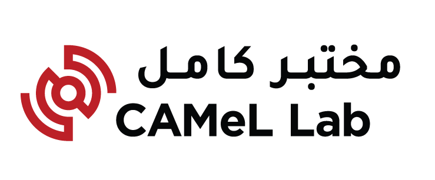

# CAMeL Lab Guideliens  {: align=right style="width:150px" } 

In the [Computational Approaches to Modeling Language (CAMeL)](http://www.camel-lab.com) Lab we work on the
development of a wide range of Arabic and Arabic dialect resources (tools,
corpora and lexicons). 
One goal we hold high is to follow consistent standards
for all of our resources.
Of course, working with Arabic dialects comes with
many challenges, as they are resource poor and have no official standards.
Our overall approach to annotation guidelines of Arabic and its dialects, is to
create common standards that are compatible with Modern Standard Arabic but
easily and naturally extended to the various dialects. 

In this site, we provide our guidelines for representing [phonology (how words are pronounced)](phonology.md),
[orthography (how words are written)](orthography.md), [morphology (how are words put together)](morphology.md),
and [syntax (how words come together to form sentences)](syntax.md).
The guidelines are versioned and backed up on GitHub. We invite you to check them out, and give
your feedback.
Each guideline section includes a discussion of high level philosophy as well as specific details, and links to publications on the
guidelines and publications and projects using the guidelines.

